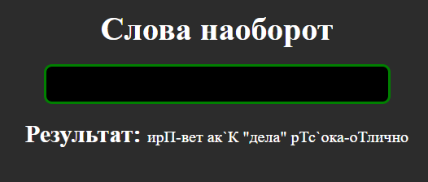

<body>
  <h1>Техническая задача</h1>
  

    Напиши метод, который принимает на вход строку и меняет порядок букв в каждом слове на обратный:
    - с сохранением регистра (например, 'Cat' -> 'Tac', 'Мышь' -> 'Ьшым', 'houSe' -> 'esuOh', 'домИК' -> 'кимОД', 'elEpHant' -> 'tnAhPele' - регистр сохраняется в соответствии с позицией прописных и строчных букв в первоначальном слове);
    - с сохранением пунктуации (например, 'cat,' -> 'tac,', 'Зима:' -> 'Амиз:', "is 'cold' now" -> "si 'dloc' won", 'это «Так» "просто"' -> 'отэ «Так» "отсорп"' - знаки препинания остаются на своих местах).
  

  

    <strong>Обрати внимание:</strong> составные слова, содержащие дефис(ы) и/или апостроф(ы),  считаются отдельными словами с символами-разделителями между ними (например, 'third-part' -> 'driht-trap', 'can`t' -> 'nac`t'). Могут использоваться буквы из любых языков, не только английского.
  

  <h2>Описание и результат</h2>
  
На входе принимает знаки: запятая, точка, которые не меняют свою позицию. Принимает дефис и опостроф, после которого не меняется порядок действий. То, что находится в ковычках("") - не меняет порядок.

  <h3>Проверка, пустая строка или нет</h3>
  
Если да, то высвечивается красная надпись:

  

  
Если нет, то выполняет код, очищает input и выдает результат:

  

  

</body>